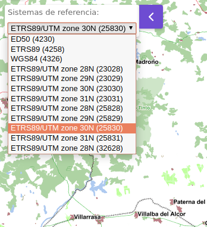

# M.plugin.SRSselector

Plugin que permite establecer el sistema de referencias en el mapa.



## Dependencias

- srsselector.ol.min.js
- srsselector.ol.min.css


```html
 <link href="../../plugins/srsselector/srsselector.ol.min.css" rel="stylesheet" />
 <script type="text/javascript" src="../../plugins/srsselector/srsselector.ol.min.js"></script>
```

## Parámetros

- El constructor se inicializa con un JSON de _options_ con los siguientes atributos:

  - **projections**. Proyecciones de origen que se mostrarán para seleccionar las coordenadas a localizar.

** Por defecto los valores posibles son:

```javascript
[
    { title: 'ETRS89 (4258)', code: 'EPSG:4258', units: 'd' },
    { title: 'WGS84 (4326)', code: 'EPSG:4326', units: 'd' },
    { title: 'WGS84 (3857)', code: 'EPSG:3857', units: 'm' },
    { title: 'ETRS89/UTM zone 31N (25831)', code: 'EPSG:25831', units: 'm' },
    { title: 'ETRS89/UTM zone 30N (25830)', code: 'EPSG:25830', units: 'm' },
    { title: 'ETRS89/UTM zone 29N (25829)', code: 'EPSG:25829', units: 'm' },
    { title: 'ETRS89/UTM zone 28N (25828)', code: 'EPSG:25828', units: 'm' },
]
```

- **position**. Indica la posición donde se mostrará el plugin
  - 'TL':top left
  - 'TR':top right (default)
  - 'BL':bottom left
  - 'BR':bottom right

## Eventos

## Otros métodos

## Ejemplos de uso

### Ejemplo 1
```javascript
  const map = M.map({
    container: 'map'
  });

  const mp = new M.plugin.SRSselector({
    position: 'TL',
  });

  map.addPlugin(mp);
```
### Ejemplo 2
```javascript
  const map = M.map({
    container: 'map'
  });

  const mp = new M.plugin.SRSselector({
    projections: [
      { title: 'WGS84 (4326)', code: 'EPSG:4326', units: 'd' },
      { title: 'ETRS89/UTM zone 31N (25831)', code: 'EPSG:25831', units: 'm' },
    ],
    position: 'TR',
  });

  map.addPlugin(mp);
```
